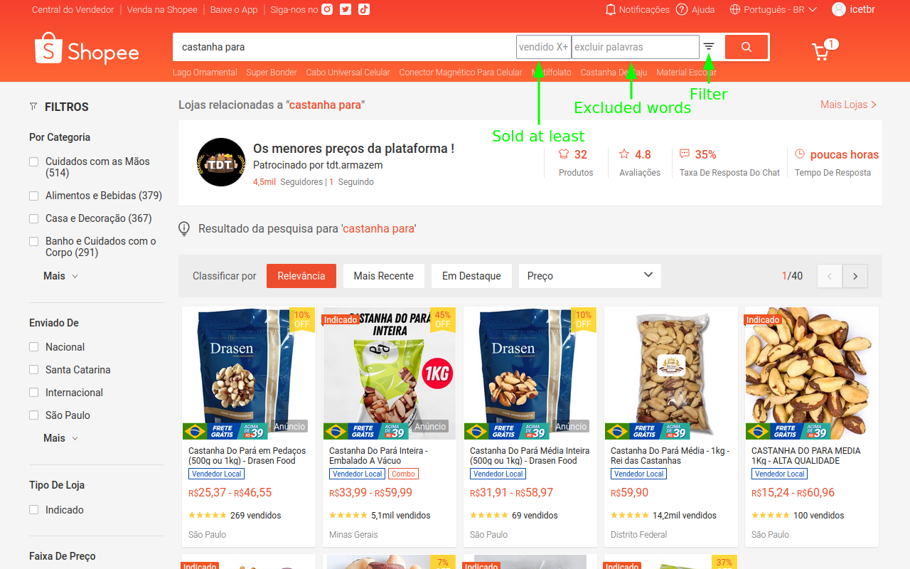

# Shopee Advanced Search
Filter search results containing ALL specified words, supporting word exclusion and minimum sold.

## Install
[Userscript][1] - [Firefox][2] - [Chrome][3].

## Usage
- automatically hides the products that don't contain ALL of the searched words
- fill in the **excluded words** box then click the **filter** button
- modify the searched words then click the **filter** button to refine your search
- leave both search boxes empty then click the **filter** button to show all results

## Why
When you search for multiple words, Shopee will return products that:
- don't contain **any** of the words
- contain **some** of the words
- contain all the words but still is **not what you expected**

Care was taken to make it **efficient** so it will have near ZERO performance impact on your searching experience[^1].

### Example
When searching for "**cashew nut**", the site returns every kind of nut, and also "cashew nut **cream**" and "cashew nut **cookies**"
With this extension, only items that have both words "**cashew**" and "**nut**" will be kept, and you can exclude "**cream**" and "**cookies**" as well.

### TODO
- FP rewrite + eslint

[^1]: A **mutation observer** ensure that the filtering occurs only at the right moments, and when all items are loaded, the script stops running.

[1]: https://openuserjs.org/users/icetbr/scripts
[2]: https://addons.mozilla.org/en-US/firefox/user/36373/

[Contributing](https://github.com/icetbr/my-projects/blob/main/CONTRIBUTING.md)\
[License (MIT)](https://choosealicense.com/licenses/mit/)
